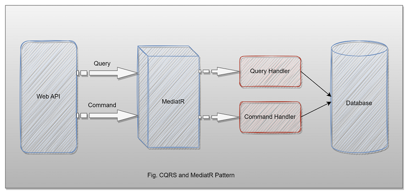

# CQRS AND MEDIATR
##### _This project is to study the operation of CQRS with MediatR. A generic context was created to which one of the attributes receives json in string format. It makes it easy to build a screen component. This object is given the status of active or inactive followed by a Guid._




CQRS stands for Command and Query Responsibility Segregation and uses to separate read(queries) and write(commands).

## Why use CQRS in C# .NET projects?
CQRS (Command Query Responsibility Segregation) is an architectural approach that separates the read (query) logic from the write (command) logic in an application. Instead of having a single service layer that handles both read and write operations, CQRS separates these responsibilities into two different layers: a command layer that handles write operations, and a query layer that handles read operations.

##### In C# .NET projects, using CQRS can bring several benefits, such as:

- Scalability: By separating read and write operations, each layer can be scaled separately. For example, it is possible to scale the query layer to handle more read requests, without affecting the command layer.

- Performance: Since the read and write logic is separated, it is possible to optimize each layer to better handle the type of operation it performs. This can lead to a significant improvement in overall application performance.

- Maintenance: By separating read and write responsibilities, it becomes easier to maintain and evolve the application over time. Changes in one layer do not necessarily affect the other, making code maintenance easier.

- Clarity: CQRS helps to separate concerns in an application, making the code clearer and easier to understand. This can help reduce complexity and improve code readability.

> Note:  However, it is important to remember that the use of CQRS is not suitable for all projects and may add unnecessary complexity to a simpler application. It is important to carefully evaluate the project's needs and potential benefits before deciding if CQRS is the right approach for the specific case.

## Why use CQRS with MediatR?

MediatR is often used in conjunction with CQRS to simplify the implementation of the command and query handlers.

##### Here are some of the benefits of using CQRS with MediatR:

- Simplified implementation: MediatR provides a simple and consistent way to implement command and query handlers. This can help to reduce the amount of boilerplate code that would be required to implement the handlers without the library.

- Loosely coupled: MediatR promotes loose coupling between the command and query handlers, making it easier to test and maintain the code. The handlers only need to implement a single interface, and the mediator takes care of the rest.

- Easy to extend: MediatR provides a straightforward way to extend the command and query handling capabilities of an application. For example, it is easy to add new handlers for different types of commands and queries.

> Note: Overall, using MediatR with CQRS can simplify the implementation of the command and query handlers, promote loose coupling, and make it easier to extend the capabilities of the application.

## Prerequisites

- Visual Studio 2022
- SQL Server
- .NET Core 6

## Plugins Install Nuget Packages

MediatR.Extensions.Microsoft.DependencyInjection Version="8.0.0" 
Microsoft.EntityFrameworkCore" Version="6.0.8"
Microsoft.EntityFrameworkCore.Design" Version="6.0.8"
Microsoft.EntityFrameworkCore.SqlServer" Version="6.0.8" 
Microsoft.EntityFrameworkCore.Tools" Version="6.0.8"

## Installation
After the run Clear Project, ReBuild Project.

Run command:

```sh
add-migration “initial”
update-database
```

## Use

This CRUD is for storing a json parameter used to build a Web or Mobile screen.
Follow the code Add:

```sh
{
    "jsonContext": {
        "widget": {
            "window": {
                "title": "Sample Widget",
                "nameClass": "main_window",
                "widthDiv": 500,
                "heightDiv": 500
            }
        }
    }
}
```

Method GetAll:

```sh
[
    {
        "id": "c428a71b-486b-49bf-96e7-05d8ff5fa65c",
        "status": true,
        "jsonContext": {
            "widget": {
                "window": {
                    "title": "Sample Widget",
                    "nameClass": "main_window",
                    "widthDiv": 500,
                    "heightDiv": 500
                }
            }
        }
    }
]
```


## License

GNU

###### Thanks for reading
